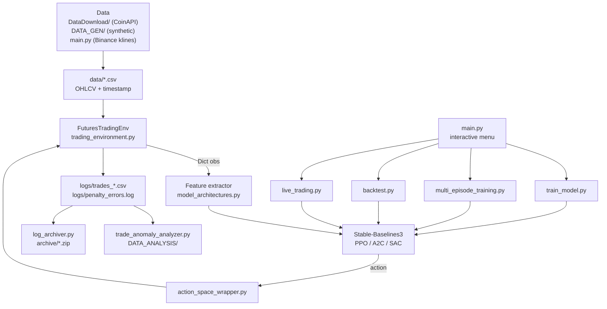

# tensortrade-btc-rl

A reinforcement-learning sandbox for BTC perpetual-futures trading. It contains
a custom Gymnasium environment that simulates a Binance USDT-margined futures
account — leverage, maker/taker fees, maintenance margin, liquidation, ATR-based
stops — plus the Stable-Baselines3 training, backtesting and trade-analysis
tooling that was built around it.

## Status: experimental research sandbox

Read this before you read anything else.

- **No trained model, no results.** No model weights, training data or
  performance figures are committed, and none are claimed. Nothing here has been
  shown to be profitable.
- **This is a single-developer research repo**, not a product. There is no CI,
  no packaging, no automated test suite (see [Tests](#tests)), and the code has
  no stable API.
- **TensorTrade is not a dependency.** The name is historical: the design was
  influenced by TensorTrade, but `tensortrade` is commented out of
  `requirements.txt` and is not imported anywhere. Everything is plain
  Gymnasium + Stable-Baselines3.
- **Funding costs are not simulated.** `FuturesTradingEnv` accepts a
  `funding_rate` argument and stores it, but nothing in the environment ever
  charges it. Any short-vs-long cost asymmetry you would see on a real venue is
  missing from the simulation.
- **`DataDownload/` is only half wired up.** `download_script.py` and
  `coinapi_downloader.py` work when run directly, but `DataDownload/__init__.py`
  and `data_manager.py` import modules that were never written, so
  `import DataDownload` fails. Use the scripts, not the package.
- Development was heavily iterative and left a long trail of fix notes. Those
  notes are preserved in [`docs/history/`](docs/history/) — they explain why
  several parts of the environment look the way they do, but they describe the
  code as of the day they were written, not necessarily as it is now.
- 32 files across the repository had been committed as empty placeholders —
  mostly under `tests/` — and have been removed. Some older documents still refer
  to them.

## How it works

The core is `trading_environment.py`, a ~3,000-line `gym.Env` subclass called
`FuturesTradingEnv`. Everything else feeds it or reads its output.

**Observation.** Raw OHLCV goes through `_prepare_features()`, which computes a
large set of `pandas_ta` indicators (SMA/EMA, RSI, Stochastic, Bollinger Bands,
ATR, MACD, ADX with DI+/DI−, Parabolic SAR, Williams %R, CCI, multi-timeframe
trend flags and a composite directional score) and then deliberately keeps only
**eight** of them as model input: `returns`, `rsi`, `ema_10`, `ema_20`, `macd`,
`adx`, `atr`, `volume_ratio`. The reduction from 27 features to 8 was a
deliberate attempt to stop the agent overtrading; the reasoning is in
[`docs/history/MINIMAL_INDICATORS_IMPLEMENTATION.md`](docs/history/MINIMAL_INDICATORS_IMPLEMENTATION.md).

The observation is a `Dict` space:

- `market_features` — `(window_size, 8)`, default window 60, standard-scaled.
  The `StandardScaler` is fitted only on the training split (first 70% by
  default) and then applied to everything, so validation data does not leak into
  the scaler.
- `portfolio_features` — 9 floats: equity ratio, normalised position size,
  normalised unrealised PnL, drawdown, normalised leverage, normalised margin
  used, consecutive losses, balance trend, unrealised-PnL trend.

**Action.** Two action spaces, selected by `use_advanced_action_space`:

- *legacy* (default, `False`): `Box(-max_leverage, +max_leverage, shape=(1,))`.
  Sign is direction, magnitude is leverage, and anything under a `0.1` threshold
  is treated as no trade.
- *advanced* (`True`): `Dict{action_type: Discrete(4) (HOLD/BUY/SELL/CANCEL),
  leverage: Box, risk_percentage: Box}`.

PPO cannot consume a `Dict` action space, so `action_space_wrapper.py` flattens
it to `Box(-1, 1, shape=(3,))` and maps the values back on the way in.

**Simulation.** `step()` executes the target position, applies taker fees,
updates ATR-derived dynamic stop-loss and take-profit levels, checks stops
against the bar's high/low, and checks liquidation against a Binance-style
maintenance-margin calculation. Positions below a dust threshold are rejected.
Every open, adjust and close is written to a trade CSV — `logs/trades_<timestamp>.csv`
for a single training run, `episodes/<episode_id>/logs/` for multi-episode runs.

**Reward.** `_calculate_enhanced_reward()` starts from the scaled equity change
and layers on tiered drawdown penalties, equity-floor penalties, consecutive-loss
penalties, trend, volatility and trading-cost penalties, and bonuses for holding
a position for a sensible duration and for recovering from drawdown. All ~45
constants are overridable through the `reward_config` argument; the defaults are
in `_setup_reward_config()`.

**Training and evaluation.** `train_model.py` builds the environment, attaches
one of three PyTorch feature extractors from `model_architectures.py`
(CNN-LSTM, attention CNN-LSTM, ResNet-LSTM) to a Stable-Baselines3 PPO/A2C/SAC
policy, and trains. `multi_episode_training.py` runs repeated
train-then-validate rounds, persists the best model and tracks per-episode
metrics. `backtest.py` replays a saved model and reports return, Sharpe,
drawdown, win rate and profit factor.



## Requirements

- Python 3.10 (the setup scripts create `python=3.10`; the conda environment the
  author used is named `rl_trading_15m`)
- Windows or Linux. The convenience scripts (`setup_windows.ps1`,
  `setup_windows.bat`, `activate_env.ps1`, `activate_env.bat`) are Windows-only;
  nothing in the Python code is.
- A CUDA GPU is optional. PyTorch on CPU works, just slowly.
- A CoinAPI key only if you want to use the CoinAPI downloader under
  `DataDownload/`.

Dependencies are pinned loosely in [`requirements.txt`](requirements.txt).
`numpy` is pinned exactly (`1.26.4`) because `pandas-ta` breaks on numpy 2.x.
Be aware that `trading_environment.py` runs `pip install pandas_ta==0.3.14b0`
for you at import time if `pandas_ta` is missing — install the requirements
first if you would rather a module did not install packages on your behalf.
`DATA_GEN/` has its own minimal [`requirements.txt`](DATA_GEN/requirements.txt)
if you only want the synthetic data generator.

## Setup

```bash
git clone https://github.com/chinthakat/tensortrade-btc-rl.git
cd tensortrade-btc-rl

conda create -n rl_trading_15m python=3.10 -y
conda activate rl_trading_15m
pip install -r requirements.txt
```

Or with a virtualenv:

```bash
python -m venv trading_venv
trading_venv/Scripts/activate      # Windows
# source trading_venv/bin/activate # Linux/macOS
pip install -r requirements.txt
```

Then check the install:

```bash
python -m scripts.check_setup
```

It reports which of the required packages import. It also prints which conda
environment is active; that line is informational — a virtualenv is fine.

If you want the CoinAPI downloader, set `COINAPI_API_KEY`. Either export it in
your shell:

```bash
export COINAPI_API_KEY=your-key       # Linux/macOS
```

```powershell
$env:COINAPI_API_KEY = "your-key"     # Windows PowerShell
```

or copy [`.env.example`](.env.example) to `.env` in the repository root and put
the key there — `DataDownload/coinapi_downloader.py` calls `load_dotenv()` when
it is imported, so the file is found whichever directory you run from. `.env` is
git-ignored. Without the variable set, the downloader raises before it makes a
request.

Installation problems — certifi corruption, TA-Lib compilation, conda
environment resets — are covered in
[`docs/INSTALLATION_GUIDE.md`](docs/INSTALLATION_GUIDE.md) and
[`docs/TROUBLESHOOTING.md`](docs/TROUBLESHOOTING.md).

## Usage

Everything is reachable from one interactive menu:

```bash
python main.py
```

The menu offers: train a new model, multi-episode training, backtest an existing
model, live trading, data preprocessing/download, view training history, archive
old logs, help, exit. It archives old logs on startup before showing the menu.

The individual entry points also run directly:

```bash
python train_model.py               # interactive single-model training
python multi_episode_training.py    # repeated train/validate rounds
python backtest.py                  # replay a saved model from models/
python live_trading.py              # live/testnet trading (prompts for API keys)
python hyperparameter_optimization.py   # Optuna search over PPO/A2C/SAC params
python trade_anomaly_analyzer.py    # cross-check a trade log against market data
```

Non-interactive tools:

```bash
# Synthetic OHLCV, for testing the pipeline without real data
python DATA_GEN/btc_data_generator.py \
    --start-date 2024-01-01 --end-date 2024-02-01 \
    --interval 15m --market-type UPTREND \
    --output data/uptrend.csv

# Historical data from CoinAPI (needs COINAPI_API_KEY)
python DataDownload/download_script.py --symbol BTCUSDT --interval 15m --last-days 90

# Post-hoc analysis of a trade log
python DATA_ANALYSIS/enhanced_trade_analyzer.py logs/trades_<run>.csv
```

Training runs need data first. Either download it (menu option 5, or
`DataDownload/`), or generate synthetic data with `DATA_GEN/`. A 96-row sample of
the generator's output is committed at
[`DATA_GEN/test_small.csv`](DATA_GEN/test_small.csv) so you can see the format;
the real datasets are not committed.

### Data format

CSV with these columns, timestamp in Unix **seconds**:

```csv
,open,high,low,close,volume,timestamp
0,42313.9,42535.0,42289.6,42532.5,3531.295,1704067200
1,42532.4,42603.2,42449.1,42458.5,2245.947,1704068100
```

## Configuration

### Environment variables

| Variable | Read by | Purpose |
| --- | --- | --- |
| `COINAPI_API_KEY` | `DataDownload/coinapi_downloader.py` (and `DataDownload/data_manager.py`, which is part of the package that does not import) | CoinAPI key for historical downloads |

That is the only variable the code reads. Both modules call `load_dotenv()`, so
the value can come either from the environment or from a `.env` file in the
repository root; see [`.env.example`](.env.example). There is no key baked into
the source — if it is not set, the downloader raises.

Binance API key and secret are **prompted for interactively** by
`live_trading.py` and are never read from the environment or from a file.

### Training configs — `configs/*.json`

`train_model.py` lists every `*.json` in `configs/` at startup and offers to load
one instead of prompting for each setting. What is committed there:

- Five hand-written presets — `ppo_quick_start.json`, `ppo_production.json`,
  `a2c_conservative.json`, `sac_experimental.json`, `hft_aggressive.json` — each
  with a `name`, `description` and `use_case`. These are the ones
  [`configs/README.md`](configs/README.md) describes.
- `config_hold_cancel_actions.json`, which uses a different and much larger
  schema of its own (`environment_config`, `reward_config`, `risk_management`,
  …) for the advanced HOLD/CANCEL action space. See
  [`docs/ENHANCED_ACTIONS_GUIDE.md`](docs/ENHANCED_ACTIONS_GUIDE.md).
- `quick_train.json`, `test.json`, `test2.json` — configs saved from interactive
  runs in July 2025. Same schema as the presets but with a placeholder
  description ("Custom training configuration") and no `use_case`.
- Four `training_session_*.json` files, written automatically by
  `train_model.py` when a run starts (they carry `"auto_generated": true`).

The table below describes the preset schema.

| Key | Meaning |
| --- | --- |
| `name`, `description`, `use_case` | Shown in the config picker |
| `data_file` | Path to the OHLCV CSV |
| `model_architecture` | `cnn_lstm`, `attention_cnn_lstm` or `resnet_lstm` |
| `algorithm` | `ppo`, `a2c` or `sac` |
| `training_params.total_timesteps` | SB3 training steps |
| `training_params.n_envs` | Parallel environments |
| `training_params.train_ratio` | Fraction of data used for training (rest is validation) |
| `training_params.initial_equity` | Starting equity, default 10000.0 |
| `training_params.max_leverage` | Leverage cap, default 25.0 |
| `training_params.window_size` | Observation lookback, default 60 |
| `training_params.stop_loss_pct` / `take_profit_pct` | Fixed-stop fallback when dynamic stops are off |
| `training_params.maintenance_margin_rate` | Maintenance margin, default 0.004 |
| `training_params.liquidation_fee_rate` | Liquidation fee, default 0.005 |
| `hyperparameters.*` | Passed to the SB3 algorithm: `learning_rate`, `batch_size`, `n_steps`, `n_epochs`, `gamma`, `gae_lambda`, `clip_range`, and the `VecNormalize` settings `use_normalization`, `norm_obs`, `norm_reward`, `clip_obs`, `clip_reward` |

Hyperparameter meanings and sensible ranges are in
[`docs/HYPERPARAMETERS_GUIDE.md`](docs/HYPERPARAMETERS_GUIDE.md).

### Log archiving — `archive_config.json`

`log_archiver.py` reads this file (falling back to identical built-in defaults
if it is missing). `main.py` and `train_model.py` both archive on startup.

| Key | Default | Meaning |
| --- | --- | --- |
| `archiving.enabled` | `true` | Master switch |
| `archiving.log_age_days` | `3` | Age at which log files are zipped away |
| `archiving.model_age_days` | `14` | Age at which model files are zipped away |
| `archiving.tensorboard_age_days` | `7` | Age at which TensorBoard runs are zipped away |
| `archiving.max_archives` | `15` | Archives kept before the oldest are deleted |
| `archiving.keep_latest_logs` | `3` | Newest log files always kept |
| `archiving.keep_latest_models` | `5` | Newest models always kept |
| `archiving.keep_latest_tensorboard` | `2` | Newest TensorBoard runs always kept |
| `archiving.exclude_models` | `["best_model.zip"]` | Never archived |
| `startup_settings.archive_on_main_start` | `true` | Archive when `main.py` starts |
| `startup_settings.archive_on_training_start` | `true` | Archive when training starts |
| `startup_settings.show_archive_progress` | `true` | Print progress while archiving |

### Templates that nothing reads

`config_template.json` and `config_hyperparameters_template.json` sit in the
root and look authoritative, but no code loads them. They are wish-lists from
early in the project and describe features that were never built (Kelly position
sizing, daily trade caps, funding optimisation). Do not treat them as
documentation.

## Project layout

```
.
├── main.py                     Interactive menu; the front door
├── trading_environment.py      FuturesTradingEnv — the simulator
├── model_architectures.py      CNN-LSTM / attention / ResNet feature extractors
├── action_space_wrapper.py     Dict <-> Box action-space conversion for PPO
├── train_model.py              Single-model training
├── multi_episode_training.py   Repeated train/validate rounds with persistence
├── backtest.py                 Replay a saved model, compute metrics
├── live_trading.py             Binance Futures live/testnet loop
├── hyperparameter_optimization.py  Optuna search
├── trade_anomaly_analyzer.py   Cross-checks trade logs against market prices
├── log_archiver.py             Zips old logs/models/TensorBoard runs
├── data_utils.py               Data validation and cleaning helpers
├── configs/                    Training presets loaded by train_model.py
├── DataDownload/               CoinAPI download and consolidation
├── DATA_GEN/                   Synthetic OHLCV generator
├── DATA_ANALYSIS/              Post-hoc trade-log analysis and PDF reports
├── scripts/                    One-off debugging scripts (see scripts/README.md)
├── tests/                      Manual check scripts (see tests/README.md)
├── docs/                       Guides
└── docs/history/               Development log, kept for reference
```

Runtime directories — `logs/`, `models/`, `data/`, `archive/`, `episodes/`,
`episode_tracking/`, `tensorboard_logs/` — are created on demand and are
git-ignored apart from their READMEs.

## Documentation

| Document | Contents |
| --- | --- |
| [`docs/INSTALLATION_GUIDE.md`](docs/INSTALLATION_GUIDE.md) | Step-by-step install, including the awkward dependencies |
| [`docs/TROUBLESHOOTING.md`](docs/TROUBLESHOOTING.md) | Certifi, TA-Lib, conda and CUDA problems |
| [`docs/ENVIRONMENT_SETUP_GUIDE.md`](docs/ENVIRONMENT_SETUP_GUIDE.md) | Auto-activating the conda environment |
| [`docs/HYPERPARAMETERS_GUIDE.md`](docs/HYPERPARAMETERS_GUIDE.md) | What each hyperparameter does and how it was tuned |
| [`docs/ENHANCED_ACTIONS_GUIDE.md`](docs/ENHANCED_ACTIONS_GUIDE.md) | The HOLD/CANCEL advanced action space |
| [`docs/DIRECTIONAL_INDICATORS_GUIDE.md`](docs/DIRECTIONAL_INDICATORS_GUIDE.md) | The directional indicators computed in `_prepare_features()` |
| [`docs/AUTO_CONTINUE_GUIDE.md`](docs/AUTO_CONTINUE_GUIDE.md) | Unattended multi-episode training |
| [`docs/history/`](docs/history/) | Chronological development log — 26 fix and analysis notes |
| [`docs/original-brief.md`](docs/original-brief.md) | The developer's own pre-code requirements notes, verbatim |
| [`configs/README.md`](configs/README.md) | What each training preset is for |
| [`DATA_GEN/README.md`](DATA_GEN/README.md) | Synthetic OHLCV generator |
| [`DATA_ANALYSIS/README.md`](DATA_ANALYSIS/README.md) | Trade-log analysis tooling |
| [`DATA_ANALYSIS/PDF_GENERATION_GUIDE.md`](DATA_ANALYSIS/PDF_GENERATION_GUIDE.md) | Generating PDF reports from trade logs |
| [`scripts/README.md`](scripts/README.md) | The one-off debugging scripts |
| [`tests/README.md`](tests/README.md) | How the manual check scripts are meant to be run |

## Tests

There is no automated test suite and no CI. `tests/` holds 38 standalone check
scripts, not pytest tests; see [`tests/README.md`](tests/README.md). The nearest
thing to a smoke test is:

```bash
python -m tests.test_system
```

Many of the other scripts have drifted from the code and reference data files
that are not committed.

## Risk warning

**This software places leveraged trades. Do not point it at real money.**

- Trading cryptocurrency futures with leverage can lose more than your deposit.
  At 25x leverage a 4% move against the position liquidates it.
- Nothing here is financial advice, and none of it is a recommendation to trade.
- No backtest result in this repository has been independently verified. Backtest
  performance does not predict live performance, and this simulator is known to
  be incomplete — it does not charge funding, models slippage only through fees,
  and fills every order at the bar price.
- `live_trading.py` is the least exercised part of the codebase. If you run it at
  all, run it against the Binance testnet
  (<https://testnet.binancefuture.com/>), with keys that have withdrawal
  disabled, and watch it.
- The author accepts no liability for any loss. Use at your own risk.

## License

MIT — see [LICENSE](LICENSE).
